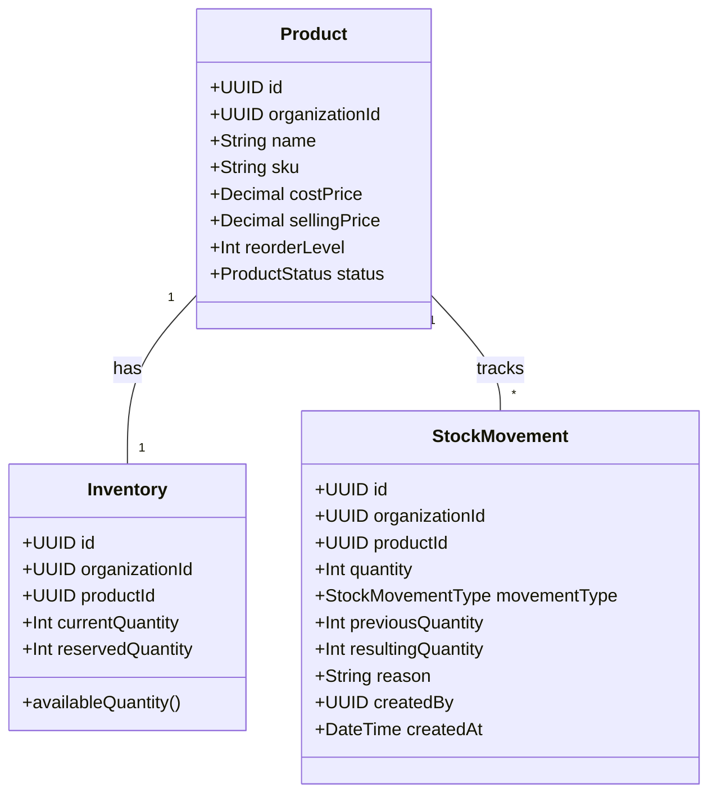

# Inventory Foundation & Stock Architecture

## 1. Overview
The Inventory Foundation decouples physical stock quantities from product catalogue master data. Instead of keeping a mutable quantity directly on the `Product` table, a dedicated `Inventory` entity holds current and reserved stock levels, linked via a 1:1 composite relation to `Product`.

---

## 2. Dedicated Inventory Model

### Invariants & Constraints
- **Composite Foreign Key**: `(productId, organizationId)` on `Inventory` references `Product(id, organizationId)` with `ON DELETE CASCADE`. The PostgreSQL engine guarantees that an inventory record cannot reference a product from another organization.
- **Unique Inventory per Product**: `@@unique([productId])` ensures exactly one inventory record exists for each product.
- **Available Quantity**: Calculated as `currentQuantity - reservedQuantity` (never below zero).

---

## 3. Strict Negative Stock Policy
Physical inventory cannot fall below zero.
- Whenever an adjustment with a negative quantity change is requested, the system computes:
  $$\text{resultingQuantity} = \text{currentQuantity} + \Delta$$
- If $\text{resultingQuantity} < 0$, the operation is immediately rejected with:
  - HTTP Status: `400 Bad Request`
  - Error Code: `INSUFFICIENT_STOCK`
  - Message: `Insufficient stock: adjustment of {delta} would result in negative stock ({resultingQuantity}). Current stock is {currentQuantity}.`
- Quantities are **never** silently clamped to zero. The entire database transaction rolls back, leaving both `Inventory` and `StockMovement` tables untouched.

---

## 4. REST API Endpoints

| Method | Path | Permission | Description |
|:---|:---|:---|:---|
| `GET` | `/api/v1/inventory` | `STOCK_VIEW` | Retrieves stock overview across all products with low-stock filtering |
| `GET` | `/api/v1/inventory/:productId` | `STOCK_VIEW` | Retrieves current, reserved, and available stock for a product |
| `POST` | `/api/v1/inventory/:productId/adjust` | `STOCK_ADJUST` | Atomically executes a positive or negative stock adjustment |
| `GET` | `/api/v1/inventory/:productId/movements` | `STOCK_VIEW` | Returns chronological audit trail of stock movements for a product |
