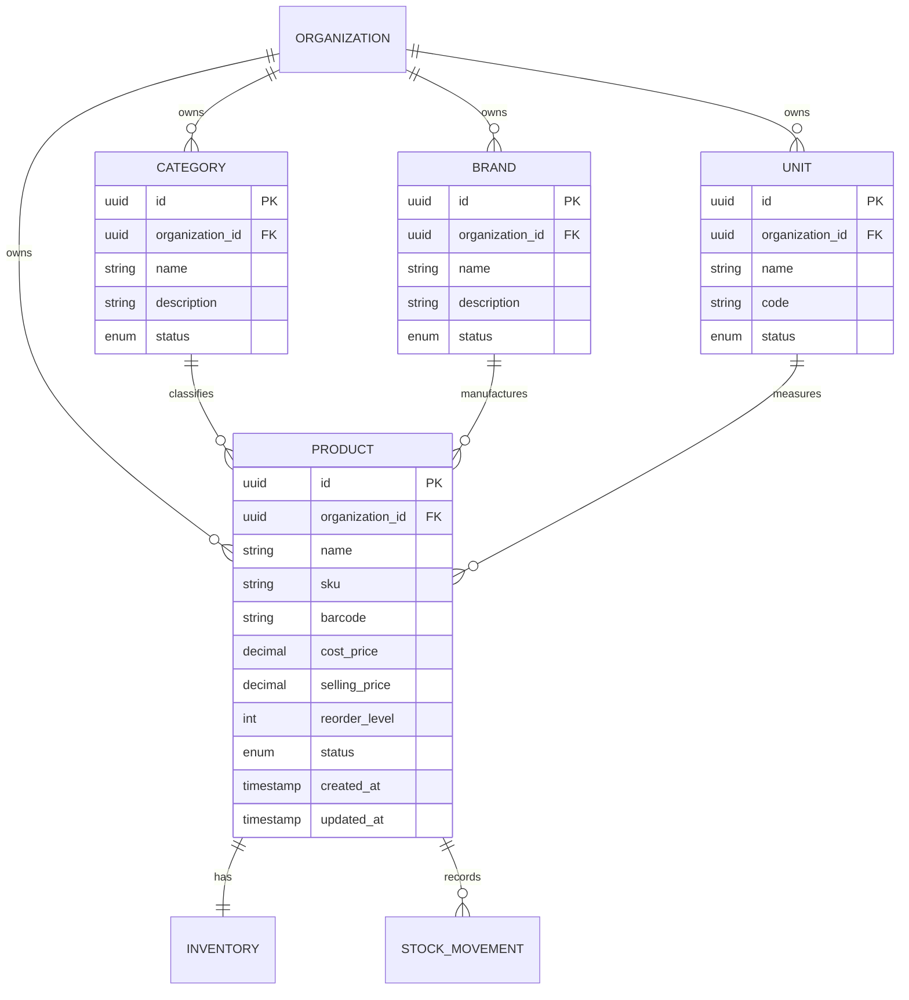

# Product Catalogue Architecture & Specification

## 1. Overview
The Product Catalogue is the core master data foundation for the Smart Inventory platform. It models business products, hierarchical classifications (Categories, Brands), Units of Measure (UoM), monetary pricing, and stock management properties.

Every catalog entity is strictly bound to its parent `Organization` to enforce enterprise multi-tenant isolation.

---

## 2. Domain & Data Model

### Key Architectural Characteristics
1. **Organization-Scoped SKU Uniqueness**:
   - Constrained by `@@unique([organizationId, sku])`.
   - Different organizations can independently use the same SKU identifier (e.g. `AMX-500`), while duplicate SKUs within the same organization are strictly prohibited at the database engine level.
2. **Monetary Precision**:
   - `costPrice` and `sellingPrice` are stored using PostgreSQL `DECIMAL(12, 2)` (via Prisma `Decimal`).
   - Prevents binary floating-point rounding errors common in JavaScript arithmetic.
3. **Unit of Measure Design**:
   - Organization-scoped `Unit` records allow tenants full flexibility for custom units (e.g. `box`, `kg`, `blister10`) while maintaining complete tenant isolation.
   - Standard units (`Piece`, `Box`, `Kilogram`, `Gram`, `Liter`, `Meter`) are automatically seeded for every newly registered organization.
4. **Soft Deactivation vs Physical Deletion**:
   - Deleting a product that has historical stock movements or positive stock performs a soft deactivation (`status = INACTIVE`), safeguarding historical audit logs from cascading deletion.

---

## 3. REST API Endpoints

### Products
| Method | Path | Required Permission | Description |
|:---|:---|:---|:---|
| `GET` | `/api/v1/products` | `PRODUCT_VIEW` | Lists products with search, classification filters, and pagination |
| `GET` | `/api/v1/products/:id` | `PRODUCT_VIEW` | Retrieves single product details with inventory and classifications |
| `POST` | `/api/v1/products` | `PRODUCT_CREATE` | Creates product, initializes dedicated inventory, and records initial stock |
| `PATCH` | `/api/v1/products/:id` | `PRODUCT_UPDATE` | Updates product attributes and classifications |
| `DELETE` | `/api/v1/products/:id` | `PRODUCT_DELETE` | Deactivates product preserving historical inventory audit trail |

### Categories, Brands, and Units
- Categories: `GET|POST /api/v1/categories`, `GET|PATCH|DELETE /api/v1/categories/:id`
- Brands: `GET|POST /api/v1/brands`, `GET|PATCH|DELETE /api/v1/brands/:id`
- Units: `GET|POST /api/v1/units`, `GET|PATCH|DELETE /api/v1/units/:id`

---

## 4. Multi-Tenant Security & Isolation
- All endpoints require authentication (`Bearer` session token) and active organization membership (`requireOrgMembership`).
- Target organization is extracted from the `x-organization-id` header or URL parameters.
- Cross-tenant requests (e.g. Org B querying Org A product ID, or referencing Org A category) are rejected with `403 Forbidden`.
