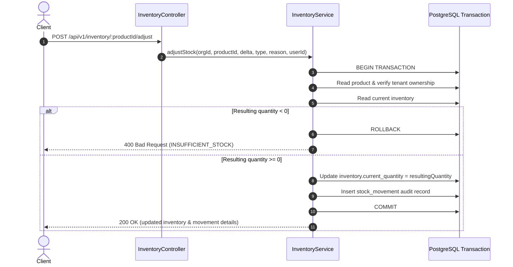

# Stock Movements & Audit History

## 1. Overview
The Stock Movement engine provides an immutable, append-only audit trail for every change to inventory quantities. Every quantity mutation creates a corresponding movement answering:

- **WHO** changed the stock? (`createdBy` user ID and relation to User)
- **WHAT** product? (`productId` and relation to Product)
- **HOW MUCH**? (`quantity` change delta $+/-$)
- **FROM** what level? (`previousQuantity`)
- **TO** what level? (`resultingQuantity`)
- **WHY**? (`reason` note and `movementType`)
- **WHEN**? (`createdAt` timestamp)

---

## 2. Movement Types
| Movement Type | Description |
|:---|:---|
| `OPENING_STOCK` | Initial physical count recorded upon product creation |
| `ADJUSTMENT` | Manual inventory recount, audit reconciliation, or count correction |
| `DAMAGE` | Written-off damaged, expired, or spoiled merchandise |
| `RETURN` | Customer return or supplier return returned back to stock |
| `PURCHASE` | Inventory intake from supplier purchase order (Phase 4 ready) |
| `SALE` | Inventory reduction from customer sales order (Phase 5 ready) |

---

## 3. Atomic Transaction Flow
All stock adjustments are executed within an atomic database transaction using `runTransaction`:

### Atomicity Guarantees
- An inventory quantity **never** changes without an accompanying stock movement record.
- A stock movement record is **never** created without an accompanying inventory update.
- Any unexpected crash or validation failure aborts the transaction cleanly.
