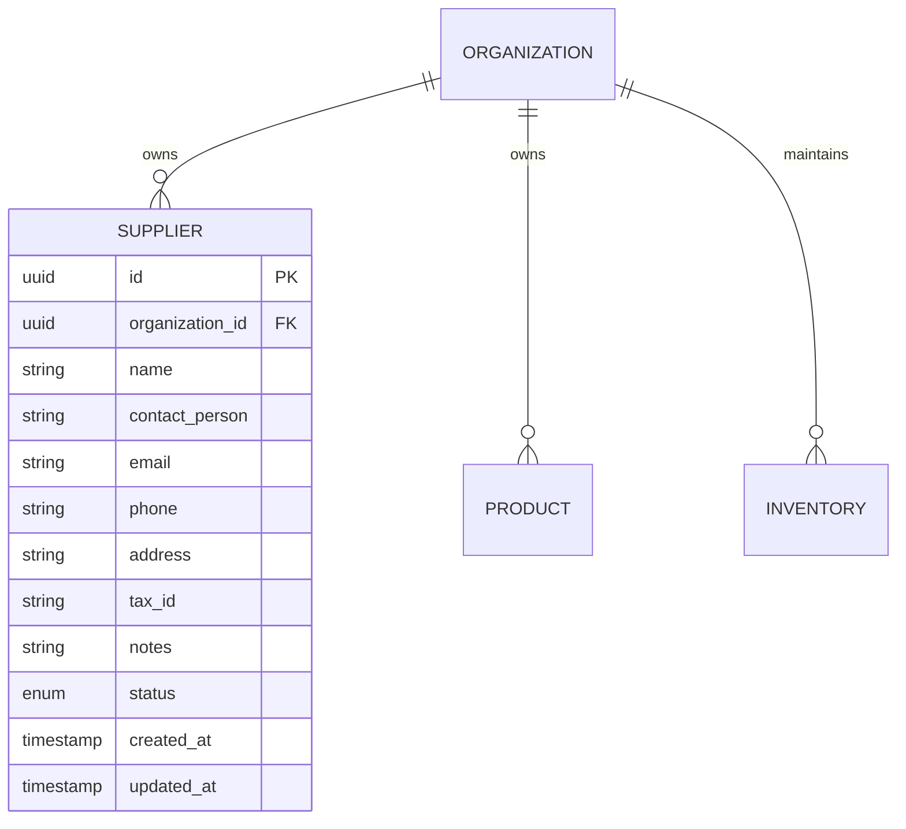

# Supplier Master Catalogue Architecture & Specification

## 1. Overview
The **Supplier Master Catalogue** serves as the master vendor registry for the Smart Inventory platform. It models business vendors, procurement points of contact, business/tax identification credentials, physical locations, payment terms/notes, and lifecycle status.

The Supplier module forms the foundational data source for procurement operations:
```
Supplier (Phase 4A)
   ↓
Purchase Order (Phase 4B)
   ↓
Receiving (Phase 4C)
   ↓
Inventory & Stock Movements (Phase 3)
```

> [!NOTE]
> In Phase 4A, **ONLY** the Supplier domain is implemented. Purchase Orders, Goods Receipt, and Vendor Invoices will be introduced in subsequent phases.

---

## 2. Domain & Data Model

Every supplier entity is strictly bound to its parent `Organization`. Cross-tenant visibility or linkage is prohibited at both the database and application levels.



### Fields & Constraints
| Field | Type | Description | Constraints |
| :--- | :--- | :--- | :--- |
| `id` | UUID | Primary Key | `@id @default(uuid())` |
| `organizationId` | UUID | Tenant Scope FK | References `organizations(id)` ON DELETE CASCADE |
| `name` | String | Commercial entity name | Required, max 200 characters |
| `contactPerson` | String | Lead sales/account manager | Optional, max 100 characters |
| `email` | String | Contact email | Optional, valid RFC format, max 255 |
| `phone` | String | Contact phone number | Optional, max 50 characters |
| `address` | String | Physical warehouse or office | Optional, max 500 characters |
| `taxId` | String | GSTIN, VAT, EIN, or business ID | Optional, organization-scoped unique |
| `notes` | String | Payment terms, delivery notes | Optional, max 2000 characters |
| `status` | Enum | Lifecycle status (`ACTIVE`, `INACTIVE`) | Defaults to `ACTIVE` |
| `createdAt` | Timestamp | Registration timestamp | Defaults to `now()` |
| `updatedAt` | Timestamp | Last modified timestamp | Auto-updated |

### Composite Invariants
- `@@unique([id, organizationId], name: "supplier_org_unique")`: Enforces tenant-boundary integrity when future `PurchaseOrder` records link to suppliers via composite foreign keys.
- `@@unique([organizationId, taxId])`: Ensures a business identifier cannot be registered twice within the same organization, while permitting different organizations to register suppliers with identical tax IDs.
- `@@index([organizationId])`: Fast tenant-scoped indexing.
- `@@index([organizationId, status])`: Optimized for filtering active/inactive vendor subsets.

---

## 3. Multi-Tenant Isolation Strategy

Tenant isolation follows the platform's multi-layered security model:

1. **Authentication & Membership Guard**:
   - Every request is validated by `requireAuth` and `requireOrgMembership`.
   - The organization context (`req.organizationId`) is resolved strictly from the verified session membership or header `x-organization-id` matching an active membership.
   - Any client attempt to inject an arbitrary `organizationId` in request payloads is ignored.

2. **Query Scoping**:
   - Every query in `SupplierService` unconditionally enforces `where: { organizationId }`.
   - Single-entity lookup (`getSupplierById`) verifies `supplier.organizationId === organizationId`. If a cross-tenant ID is queried, access is denied with `403 Forbidden` and no cross-tenant data is leaked.

3. **Database-Level Composite Keys**:
   - The composite unique constraint `[id, organizationId]` prevents cross-organization relational leaks at the database engine level.

---

## 4. Supplier Lifecycle & Status Management

The supplier lifecycle adheres to a non-destructive, audit-preserving pattern:

- **`ACTIVE`**: The supplier is verified and available for procurement, inventory orders, and active communication.
- **`INACTIVE`**: The supplier is deactivated (soft-delete). Deactivated suppliers are retained for historical audit trails, procurement records, and tax accounting.

### Safe Deactivation / Destruction Policy
- Deactivating a supplier (`PATCH /api/v1/suppliers/:id` with `{ status: "INACTIVE" }`) is the standard practice.
- `DELETE /api/v1/suppliers/:id` is protected: in future phases, suppliers with attached Purchase Orders or Goods Receipts cannot be physically destroyed. If unreferenced, physical cleanup is allowed.

---

## 5. Authorization & RBAC Permissions

Supplier actions are guarded by permissions mapped across organization roles:

| Permission | Description | Allowed Roles |
| :--- | :--- | :--- |
| `SUPPLIER_VIEW` | Can view supplier profiles, search catalogue, inspect details | Owner, Store Manager, Pharmacist, Inventory Staff |
| `SUPPLIER_CREATE` | Can register and onboard new vendors | Owner, Store Manager, Inventory Staff |
| `SUPPLIER_UPDATE` | Can edit vendor profiles, terms, and toggle `ACTIVE`/`INACTIVE` status | Owner, Store Manager, Inventory Staff |

---

## 6. REST API Endpoints

All endpoints are mounted under `/api/v1/suppliers` (and `/api/v1/organizations/:orgId/suppliers`).

### 1. List Suppliers
- **Endpoint**: `GET /api/v1/suppliers`
- **Permission**: `SUPPLIER_VIEW`
- **Query Parameters**:
  - `search`: Case-insensitive substring matching against `name`, `contactPerson`, `email`, `phone`, and `taxId`.
  - `status`: `ACTIVE` or `INACTIVE`.
  - `page`: Page number (default `1`).
  - `limit`: Items per page (default `50`, max `100`).
- **Response**: Standard Phase 2 envelope containing `data: Supplier[]`, `meta: { page, limit, total, totalPages }`, and `metrics: { total, active, inactive }`.

### 2. Get Supplier Details
- **Endpoint**: `GET /api/v1/suppliers/:id`
- **Permission**: `SUPPLIER_VIEW`
- **Response**: `data: Supplier`

### 3. Create Supplier
- **Endpoint**: `POST /api/v1/suppliers`
- **Permission**: `SUPPLIER_CREATE`
- **Request Body**:
  ```json
  {
    "name": "Apex Medical Supplies Ltd.",
    "contactPerson": "Dr. Rajesh Rao",
    "email": "orders@apexsupplies.test",
    "phone": "+91-9876543210",
    "address": "42 Industrial Avenue, Hyderabad",
    "taxId": "GSTIN-36AABCB1234F1Z5",
    "notes": "Net-30 payment terms",
    "status": "ACTIVE"
  }
  ```
- **Response**: `201 Created` with `data: Supplier`

### 4. Update Supplier
- **Endpoint**: `PATCH /api/v1/suppliers/:id`
- **Permission**: `SUPPLIER_UPDATE`
- **Request Body**: Partial update payload.
- **Response**: `200 OK` with `data: Supplier`

### 5. Deactivate / Delete Supplier
- **Endpoint**: `DELETE /api/v1/suppliers/:id`
- **Permission**: `SUPPLIER_UPDATE`
- **Response**: `200 OK` with `{ action: "DELETED", message: "..." }`

---

## 7. Next Phase: Phase 4B — Purchase Orders

Phase 4A establishes the vendor master catalogue. Phase 4B will connect this catalogue to inbound procurement:

```
Supplier Master Record (Phase 4A)
          │
          ▼
Purchase Order (Draft ──► Pending Approval ──► Approved ──► Issued)
          │
          ▼
Goods Receipt / Receiving (Phase 4C)
          │
          ▼
Inventory Stock Movement: PURCHASE (Phase 3)
```
